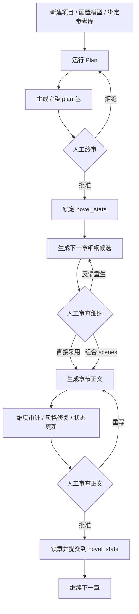

<p align="center">
  
</p>

<p align="center">
  面向长篇网络小说创作的本地化、Human-in-the-loop、多 Agent 写作工作台
</p>

<p align="center">
  把大纲、正文、审计、风格、考据、状态管理和人审节点，组织成一条可追踪的长篇写作流水线。
</p>

<p align="center">
  <a href="https://github.com/Kailai1104/Novelex"></a>
  <a href="./LICENSE"></a>
  = 20">
  
  
</p>

<p align="center">
  <a href="#5-分钟快速上手">快速开始</a> ·
  <a href="#核心能力">核心能力</a> ·
  <a href="#这套系统是怎么工作的">工作流</a> ·
  <a href="#环境准备">环境准备</a> ·
  <a href="#许可证">许可证</a>
</p>

## 设计哲学

> Novelex 强调 **Human-in-the-loop**，信奉 **The more tokens, the better the effect**，主打依靠文件系统管理上下文。欢迎有相同理念的小伙伴们向本项目提交 issue 或 PR，一起来完善 Novelex.

## 项目定位

Novelex 适合下面这类创作场景：

- 想写中长篇网文，而不是一次性生成短篇片段。
- 希望把“大纲”和“正文”拆开管理，而不是全靠一条 prompt 硬顶。
- 需要人工介入关键节点，比如终审大纲、选择章节细纲、批准或重写正文。
- 希望把风格、考据、范文参考、黄金三章参考、伏笔与人物状态纳入同一套流程。
- 需要明确看到系统到底用了哪些上下文、输出了哪些中间文件、为什么会给出当前结果。

## 核心能力

- 多项目工作区：同一个工作区下可以创建多个独立小说项目，每个项目有自己的 `novel_state` 和 `runtime`。
- 本地文件原生工作流：核心状态直接保存在本地 Markdown / JSON 中，方便人工审阅、版本管理和二次加工。
- 两阶段写作编排：
  - `Plan` 阶段负责人物、粗纲、结构、世界观、伏笔、角色资料与最终锁定大纲。
  - `Write` 阶段负责章节细纲候选、正文、审计、重写、状态更新与锁章。
- Human-in-the-loop：大纲锁定前有人审，章节细纲有人审，正文锁章前也有人审。
- 风格指纹库：可从范文自动抽取叙述距离、措辞、句式节奏、对白习惯、章末收束等稳定风格特征，并生成可复用的写作指令。
- 共享范文 RAG：可建立共享范文库，按项目绑定，供章节写作时做“只借写法、不借句子”的参考。
- 黄金三章参考库：可建立优秀开篇参考库，在大纲阶段和前 1-3 章写作时注入开篇结构经验。
- 研究检索链路：章节写作前会先判断是否需要考据；如果需要，会调用带 `web_search` 工具的研究检索链路生成“研究资料包”。
- 输入治理与可追溯：会生成 `chapter_intent`、`context_package`、`rule_stack`、`trace` 等治理与追踪文件，明确本章必须保留什么、必须避免什么、引用了哪些来源。
- 维度化审计：围绕大纲偏移、人物可信、伏笔推进、视角一致性、元信息泄漏、信息越界、考据准确、节奏单调、风格漂移等维度审计正文。
- 自动降级与 fallback：历史检索、上下文整理、语义审计等子链路失败时，不会悄悄吞掉，而是显式回退并把 fallback 信息写进运行记录和中间产物。

## 这套系统是怎么工作的



### 当前默认主流程

1. 创建项目并填写作品设定。
2. 视需要绑定风格指纹、范文库、黄金三章参考库。
3. 点击 `Plan`，系统生成完整的大纲包。
4. 你对最终大纲做一次终审。
5. 批准后，大纲被锁定，写作进入 `Write` 阶段。
6. 系统先生成下一章的多套细纲候选。
7. 你可以直接采用一套候选，也可以从多个方案里挑 scene 进行组合定稿。
8. 系统据此生成正文、审计结果和所有章节状态文件。
9. 你决定批准锁章，或者按反馈重写整章 / 局部场景 / 调整场景顺序后重写。

说明：

- 仓库里仍保留了 `plan_draft` 的兼容审查接口，但当前主路径已经是“直接跑到完整 plan 包，再等待单次终审”。
- `Write` 阶段同一时刻只允许存在一个待审节点。

## 功能分层

### 1. 多项目工作区

- 项目存放在 `projects/<project-id>/` 下。
- 每个项目有独立的：
  - `projects/<project-id>/novel_state`
  - `projects/<project-id>/runtime`
- 风格指纹、范文库、黄金三章参考库是工作区级共享资源，存放在根目录 `runtime/` 下，可跨项目复用。

### 2. Plan 阶段

Plan 阶段不只是“写个大纲”，而是会产出一整套长期写作基础设施：

- 主角团 / 对手 /盟友 / 支线角色规划。
- 一句话核心梗、简纲、粗纲。
- 阶段划分与章节结构蓝图。
- 世界观与世界状态初稿。
- 角色小传、人物卡、人物线摘要、状态文件。
- 伏笔注册表。
- 锁定后的 `bundle.json`。

Plan 阶段内部还包含自动评审与回炉：

- Outline Critic。
- Structure Critic。
- 预审 critic。
- 预审回炉与缓存复用。

当自动预审无法彻底解决问题时，系统不会无限重试，而是把残留问题带到人工终审节点。

### 3. Write 阶段

Write 阶段也不是“一步出正文”，而是拆成两个子阶段：

#### 3.1 章节细纲候选

- 先根据已锁定大纲计算本章基础章纲。
- 拉取阶段目标、人物状态、历史章节、连续性压力。
- 对第 1-3 章额外注入黄金三章结构参考。
- 生成 2-5 套细纲候选。
- 支持两种审查方式：
  - 直接采用某个 proposal。
  - 从多个 proposal 中挑 scene 组合成最终细纲。

#### 3.2 正文生成与锁章

- 整理计划侧上下文、历史侧上下文、研究资料包、范文参考包、黄金三章参考包。
- 构建输入治理契约。
- 按 scene 生成正文草稿。
- 跑启发式 + 语义审计。
- 必要时自动做风格修复或基于审计结果重写。
- 更新：
  - 章节 Markdown
  - 章节 meta
  - 角色状态
  - 世界状态
  - 伏笔注册表
  - 审计漂移报告

人工审稿时支持：

- 直接批准锁章。
- 整章重写。
- 只重写选中的 scene。
- 调整 scene 顺序后再重写。

### 4. 风格指纹库

风格指纹是 Novelex 很重要的一层“长期风格基线”。

你可以粘贴一篇范文，让系统抽取：

- 叙述视角与贴脸距离
- 措辞与语域
- 句式节奏
- 修辞与意象
- 对白习惯
- 情绪温度
- 场景推进
- 章末收束
- 建议项
- 禁止项

生成后的风格指纹会保存到共享目录，可跨项目复用，也可在 UI 中二次编辑 Writer 实际使用的风格指令。

### 5. 共享范文 RAG

范文 RAG 的用途不是让模型照抄句子，而是为章节提供“叙事技法、场景组织、人物推进方式、气口与节奏”的参考。

它的工作方式是：

1. 新建共享 collection。
2. 手动把 `.txt` / `.md` 文件放进对应 `sources/` 目录。
3. 点击“重建索引”。
4. 章节写作时，系统先生成检索 query，再做混合检索，再把命中片段压缩成范文参考包。

支持特点：

- 支持 `utf-8`、`utf-16le`、`gb18030` 编码识别。
- 使用智谱 embedding 建立向量索引。
- 检索失败时不会直接阻塞章节写作，而是显式降级成 fallback 参考包。

### 6. 黄金三章参考库

黄金三章参考库和普通范文库不同，它只服务于“开头结构”。

它会总结：

- 开场钩子模式
- 主角亮相方式
- 冲突点燃方式
- 前三章节奏信号
- 章末牵引方式
- 推荐结构拍点
- 应避免的开头坏习惯

实际生效范围：

- `Plan` 阶段会参考绑定的黄金三章库。
- `Write` 阶段只在第 1-3 章强注入。
- 第 4 章以后不再继续注入黄金三章参考。

### 7. 研究检索链

研究链路由三步组成：

1. `ResearchPlannerAgent`
2. `ResearchRetriever`
3. `ResearchSynthesizerAgent`

它的逻辑不是“历史题材才检索，现代题材不检索”，而是：

- 每章都会先判断是否需要研究。
- 如果不需要，就生成一个空研究包并继续。
- 如果需要，就调用 `web_search` 工具生成研究资料包。

研究资料包会包含：

- 本章应该直接采用的事实
- 应避免的误写
- 可用术语
- 未决点
- 来源备注

### 8. 输入治理与 trace

这是项目很有价值、也很容易被忽略的一层。

在真正把上下文喂给 Writer 前，Novelex 会先构建：

- `chapter_intent.json`
- `context_package.json`
- `rule_stack.json`
- `trace.json`

这些文件的作用分别是：

- `chapter_intent`：定义本章目标、必须保留、必须避免、风格强调、伏笔 agenda。
- `context_package`：列出本章最终选中的上下文来源。
- `rule_stack`：把硬事实、软目标、延后规则、当前任务按优先级堆起来。
- `trace`：记录到底用了哪些文档、哪些 prompt 输入、哪些研究来源和参考来源。

如果你希望排查“这一章为什么写成这样”，这些文件非常有用。

### 9. 审计系统

正文生成后，系统会按维度审计，而不是只给一句模糊的“写得还行/不太行”。

代码中已实现的审计维度包括：

- `outline_drift`：是否偏离本章硬性事件和章末钩子
- `character_plausibility`：人物动机与行为是否可信
- `foreshadowing_progress`：伏笔有没有真正推进
- `pov_consistency`：第三人称有限视角是否稳定
- `meta_leak`：是否泄漏提纲语 / 系统元信息 / 说明文语气
- `knowledge_boundary`：角色是否知道自己不该知道的信息
- `research_accuracy`：是否违背研究资料包
- `hook_overpayoff`：是否提前回收后续钩子
- `chapter_pacing`：单章节奏是否失衡
- `sequence_monotony`：最近几章是否过于同构
- `subplot_stagnation`：支线和旧债是否长期不推进
- `style_drift`：是否偏离既有风格基线

如果语义审计不可用，系统会退回启发式审计，并把这一点明确记录下来。

## 目录结构

下面是仓库的核心目录结构：

```text
.
├─ public/                        # 前端控制台
│  ├─ index.html
│  ├─ app.js
│  └─ styles.css
├─ src/
│  ├─ config/                     # TOML 配置解析与保存
│  ├─ core/                       # 默认状态、生成器、审计维度、治理、文本工具
│  ├─ llm/                        # Provider 路由与请求封装
│  ├─ opening/                    # 黄金三章参考库与检索
│  ├─ orchestration/              # Plan / Write / Audit / Style Fingerprint 编排
│  ├─ rag/                        # 范文 RAG 索引与检索
│  ├─ retrieval/                  # 历史检索与 Writer 上下文构建
│  ├─ utils/                      # store / workspace / paths
│  └─ server.js                   # 本地 HTTP 服务入口
├─ projects/
│  └─ <project-id>/
│     ├─ novel_state/             # 每个项目自己的已提交状态
│     └─ runtime/                 # 每个项目自己的运行态 / staging / reviews / runs
├─ runtime/
│  ├─ style_fingerprints/         # 工作区共享风格指纹
│  ├─ rag_collections/            # 工作区共享范文库
│  └─ opening_collections/        # 工作区共享黄金三章参考库
├─ test/                          # Node 内置测试
├─ novelex.codex.example.toml     # 可提交到仓库的配置模板
├─ novelex.codex.toml             # 本地私有模型与 embedding 配置
└─ package.json
```

### `novel_state` 与 `runtime` 的区别

- `novel_state/`：已提交、已锁定、会被后续章节持续读取的长期状态。
- `runtime/staging/`：当前阶段或当前章节的中间产物。
- `runtime/runs/`：运行记录。
- `runtime/reviews/`：人工审查记录。

### 共享资源为什么放在根目录 `runtime/`

因为风格指纹库、范文库、黄金三章参考库是“工作区共享资产”，不是单项目私有资产。代码里已经实现了跨项目复用。

### 旧版单项目数据的兼容

如果工作区里还保留旧版的根目录 `runtime/project-state.json` 与 `novel_state/`，而 `projects/` 目录还为空，系统会在首次列项目时把旧数据自动引导成 `projects/default`。

## 环境准备

### 1. Node.js

建议使用较新的 Node.js 版本，推荐 Node.js 20+。

这是基于源码做出的建议，因为项目直接依赖了现代 Node 内置能力，例如：

- `fetch`
- `ReadableStream`
- `TextDecoder`
- `node --watch`

仓库当前没有声明 `engines` 字段，也没有第三方 npm 依赖。

### 2. 大模型 Provider

Novelex 的正文生成、计划生成、审查和风格抽取都依赖外部模型 provider。

当前代码路径重点支持：

- OpenAI `responses` 协议
- 兼容 OpenAI 的 `chat_completions` 协议

### 3. 智谱 Embedding

下面两类能力依赖智谱 embedding：

- 重建范文库索引
- 重建黄金三章参考库索引
- 实际运行 RAG / Opening 检索时的 query embedding

因此，如果你要使用范文库或黄金三章参考库，请准备：

- `ZHIPU_API_KEY`
- 或 `novelex.codex.toml` 中的 `zhipu_api_key`

### 4. Research web search 路由说明

研究检索链路中的 `web_search` 工具现在统一走 MCP：

- 应用进程会作为 MCP client 管理 `web_search` 与 `local_rag` 两台 stdio server。
- `web_search` 默认使用 MiniMax 的 Coding Plan MCP：`npx -y minimax-coding-plan-mcp`
- `local_rag` 默认使用仓库内置的 `src/mcp/servers/local-rag.js`
- `web_search` MCP 不可用时，Research 链会降级为 `search_failed`，但章节写作仍继续。
- 当前构建会为 `web_search` 自动准备项目内 `runtime/npm-cache`，并在旧配置仍写成 `uvx` 且本机没有 `uvx` 时自动回退到 `npx`。
- 对于 `npx/uvx minimax-coding-plan-mcp` 的冷启动安装，运行时会把 `startup_timeout_ms` 自动抬到至少 60 秒，避免首次联网拉包时误判为启动失败。

这意味着：

- `ResearchRetriever` 不再依赖 provider 内置 tool routing。
- 主写作模型可以继续使用 OpenAI / MiniMax / 兼容 provider；Research 的联网搜索由 MCP server 单独负责。

## 配置方式

### `novelex.codex.toml`

项目优先从根目录的 `novelex.codex.toml` 读取模型配置。UI 中的“模型切换”也会直接写回这个文件。

建议先复制仓库中的示例模板：

```bash
cp novelex.codex.example.toml novelex.codex.toml
```

一个最小可用模板如下：

```toml
model_provider = "MiniMax"
model = "MiniMax-M2.5-highspeed"
review_model = "MiniMax-M2.5-highspeed"
codex_model = "MiniMax-M2.5-highspeed"
model_reasoning_effort = "high"
disable_response_storage = true
zhipu_api_key = "YOUR_ZHIPU_API_KEY"
force_stream = false

[mcp]
enabled = true

[mcp.servers.web_search]
enabled = true
transport = "stdio"
command = "npx"
args = ["-y", "minimax-coding-plan-mcp"]
startup_timeout_ms = 60000
call_timeout_ms = 30000

[mcp.servers.web_search.env]
MINIMAX_API_HOST = "https://api.minimaxi.com"

[mcp.servers.local_rag]
enabled = true
transport = "stdio"
command = "node"
args = ["src/mcp/servers/local-rag.js"]
startup_timeout_ms = 10000
call_timeout_ms = 30000

[model_providers.OpenAI]
name = "OpenAI"
base_url = "https://api.openai.com/v1"
wire_api = "responses"
response_model = "gpt-5.4"
review_model = "gpt-5.4"
codex_model = "gpt-5.3-codex"
requires_openai_auth = true
api_key = "YOUR_OPENAI_API_KEY"

[model_providers.MiniMax]
name = "MiniMax"
base_url = "https://api.minimaxi.com/v1"
wire_api = "chat_completions"
response_model = "MiniMax-M2.5-highspeed"
review_model = "MiniMax-M2.5-highspeed"
codex_model = "MiniMax-M2.5-highspeed"
api_key = "YOUR_MINIMAX_API_KEY"
max_concurrency = 1
request_timeout_ms = 300000
overload_retry_window_ms = 1800000
```

### 关键字段说明

| 字段 | 作用 |
| --- | --- |
| `model_provider` | 当前激活的 provider id |
| `model` | 默认正文 / 主生成模型 |
| `review_model` | 审查、研究规划、风格分析等偏 review 任务模型 |
| `codex_model` | 代码/工具链相关模型名 |
| `model_reasoning_effort` | 推理强度 |
| `disable_response_storage` | 是否让 responses API 存储响应 |
| `zhipu_api_key` | 智谱 embedding API key |
| `[model_providers.<id>]` | provider 具体配置块 |
| `wire_api` | `responses` 或 `chat_completions` |
| `base_url` | provider 基础地址 |
| `api_key` | provider API key |
| `max_concurrency` | provider 级请求并发上限，MiniMax 建议从 `1` 开始 |
| `request_timeout_ms` | 单次请求超时，MiniMax 可适当调大 |
| `overload_retry_window_ms` | 遇到 429/529 等拥挤错误时的总等待窗口 |

### 环境变量替代

代码里也支持从环境变量取值，例如：

- `OPENAI_API_KEY`
- `OPENAI_BASE_URL`
- `MINIMAX_API_KEY`
- `MINIMAX_BASE_URL`
- `ZHIPU_API_KEY`

如果你定义了自定义 provider，默认也会尝试读取：

- `<PROVIDER>_API_KEY`
- `<PROVIDER>_BASE_URL`

例如 provider id 为 `Compat`，会尝试读取：

- `COMPAT_API_KEY`
- `COMPAT_BASE_URL`

### 安全提醒

公开仓库时不要提交真实 API key。

更稳妥的做法是：

- 用环境变量注入敏感配置；
- 或只在本地保留私有的 `novelex.codex.toml`；
- GitHub 上展示 README 里的占位模板，不要提交真实密钥。

## 上传到 GitHub（不包含本地项目与 API key）

如果你只想上传功能代码，而不上传本地正在跑的小说项目、运行产物和 API key，可以按下面做：

1. 保留真实配置在本地 `novelex.codex.toml`，仓库里只提交 `novelex.codex.example.toml`。
2. 确认 `.gitignore` 已忽略这些本地内容：
   - `novelex.codex.toml`
   - `novel_state/`
   - `projects/`
   - `runtime/`
3. 初始化仓库并先检查待提交文件：

```bash
git init
git status --ignored
git add .
git status
```

4. 确认 `git status` 里只有代码和文档后，再提交：

```bash
git commit -m "Initial commit"
```

5. 关联 GitHub 仓库并推送：

```bash
git branch -M main
git remote add origin <你的 GitHub 仓库地址>
git push -u origin main
```

如果你之前已经误提交过真实 key，即使后来删掉文件，也建议立刻去对应平台重新生成新 key，因为旧 key 可能已经泄露。

## 启动方式

### 直接启动

当前仓库没有外部 npm 依赖，所以克隆后通常可以直接启动：

```bash
npm start
```

开发模式：

```bash
npm run dev
```

默认端口：

```text
http://localhost:3000
```

也可以通过环境变量改端口：

```bash
PORT=4000 npm start
```

### 健康检查

```bash
curl http://localhost:3000/api/health
```

## 5 分钟快速上手

### 第一步：准备配置

确认以下能力已经准备好：

- 至少一个可用的大模型 provider。
- 如果要用范文库 / 黄金三章参考库，再准备好智谱 embedding key。
- 如果要稳定使用研究检索，建议同时保留可用的 MiniMax 或 OpenAI 搜索 provider。

### 第二步：启动服务并打开控制台

运行：

```bash
npm start
```

浏览器打开：

```text
http://localhost:3000
```

### 第三步：新建项目

在页面顶部工作区栏：

- 输入新项目名。
- 点击创建。
- 选择当前项目。

### 第四步：填写作品设定

在“项目设定”面板里填写：

- 标题
- 类型
- 故事前提
- 设定 / 场域
- 主题
- 主角目标
- 目标章节数
- 单章目标字数
- 阶段数
- 风格备注
- 研究备注

说明：

- 大纲锁定后，项目核心设定不能再直接通过 UI 改动。
- 如果你在锁定后还想大改题材、世界观或总目标，需要扩展或手动重置流程。

### 第五步：可选配置风格 / 范文 / 黄金三章

#### 风格指纹

如果你希望系统长期模仿某种稳定文风：

1. 在“风格指纹库”里填写名称。
2. 粘贴范文。
3. 点击生成。
4. 生成后把它设为当前项目使用的章节风格。

#### 范文库

如果你希望正文写法得到范文参考：

1. 创建一个共享范文 collection。
2. 把范文 `.txt` / `.md` 文件放进它的 `sources/` 目录。
3. 点击“重建索引”。
4. 回到项目，把该 collection 绑定给当前项目。

#### 黄金三章参考库

如果你特别重视开篇结构：

1. 创建一个 opening collection。
2. 把优秀作品前三章放进对应 `sources/`。
3. 点击“重建索引”。
4. 绑定到当前项目。

### 第六步：推进 Plan

点击“推进 Plan 阶段”后，系统会：

- 生成人物规划
- 生成粗纲
- 扩展角色资料
- 生成结构与阶段蓝图
- 生成世界观与世界状态
- 生成伏笔注册表
- 运行自动 critic / 预审
- 把完整 plan 包写入 staging

正常情况下，当前主流程会直接进入“最终大纲审查”。

### 第七步：终审并锁定大纲

你可以：

- 批准：把 staging 中的最终 plan 提交到 `novel_state/`
- 拒绝：写反馈，让系统重新修订

批准后：

- `phase.plan.status = locked`
- `Write` 阶段开放

### 第八步：生成章节细纲候选

在 `Write` 面板里：

- 选择候选数：2-5
- 选择发散度：`standard` 或 `wide`
- 点击“生成下一章细纲”

系统会：

- 推导当前章节基础章纲
- 整理阶段目标、人物压力、历史余波与连续性
- 生成多套候选细纲

### 第九步：审查章节细纲

你有三种用法：

- 直接采用一个 proposal
- 从多个 proposal 里挑 scene 组合成最终方案
- 写反馈并重生候选

一旦细纲确认，系统才会进入正文生成。

### 第十步：审查章节正文

正文生成后，系统会把以下内容一起准备好：

- Writer Context
- History Context
- Reference Packet
- Opening Reference Packet
- Research Packet
- Validation
- Audit Drift
- Character State 更新
- World State 更新

你可以：

- 直接批准锁章
- 整章重写
- 仅重写选中的 scene
- 调整 scene 顺序后重写

批准后，本章会被提交到 `novel_state/chapters/`，并更新项目长期状态。

## 更完整的日常使用流程

### 1. 先搭“长期资产”，再开始写

推荐顺序：

1. 先把项目设定写清楚。
2. 再做风格指纹。
3. 再准备范文库。
4. 再准备黄金三章参考库。
5. 然后开始 Plan。

这样后面的章节上下文会更稳定。

### 2. 把 Document Browser 当作“流程显微镜”

前端自带文档浏览器，你可以直接查看：

- 已提交文档
- staged 文档
- 共享文档

如果你要调 prompt、排查上下文、理解为什么某一章写偏了，这个面板非常有用。

### 3. 第一章批准后的风格基线

如果项目没有显式选择风格指纹：

- 第一章批准后，系统会自动从首章沉淀 `novel_state/style_guide.md`

如果项目已经选择了风格指纹：

- 系统不会在第一章批准时覆盖掉原有风格基线

### 4. 前三章与后续章节的差异

第 1-3 章会额外吃到：

- 黄金三章参考包

第 4 章以后：

- 不再继续注入黄金三章结构参考
- 转而完全由已锁定的大纲、历史正文、风格基线和范文参考来主导

## 运行中会生成哪些文件

### Plan 阶段 staging

典型输出目录：

```text
projects/<project-id>/runtime/staging/plan/
├─ draft.json
├─ outline_draft.md
└─ final/
   ├─ bundle.json
   ├─ outline.md
   ├─ outline_data.json
   ├─ worldbuilding.md
   ├─ structure.md
   ├─ structure_data.json
   ├─ world_state.json
   ├─ foreshadowing_registry.json
   ├─ style_guide.md
   └─ characters/
```

### Plan 阶段提交后

会进入：

```text
projects/<project-id>/novel_state/
├─ bundle.json
├─ outline.md
├─ outline_data.json
├─ worldbuilding.md
├─ structure.md
├─ structure_data.json
├─ world_state.json
├─ foreshadowing_registry.json
├─ style_guide.md
└─ characters/
```

### Write 阶段 staging

每章会有一个独立目录，例如：

```text
projects/<project-id>/runtime/staging/write/ch001/
├─ ch001.md
├─ ch001_meta.json
├─ bundle.json
├─ scene_drafts.json
├─ validation.json
├─ audit_drift.json
├─ audit_drift.md
├─ chapter_intent.json
├─ context_package.json
├─ rule_stack.json
├─ trace.json
├─ writer_context.json
├─ writer_context.md
├─ plan_context.json
├─ plan_context.md
├─ history_context.json
├─ history_context.md
├─ outline_context.json
├─ outline_context.md
├─ outline_candidates.json
├─ selected_chapter_outline.json
├─ research_packet.json
├─ research_packet.md
├─ reference_packet.json
├─ reference_packet.md
├─ opening_reference_packet.json
├─ opening_reference_packet.md
├─ world_state.json
├─ foreshadowing_registry.json
├─ characters/
└─ provider_snapshot.json
```

### 章节批准后会提交哪些文件

典型提交结果：

```text
projects/<project-id>/novel_state/chapters/
├─ ch001.md
├─ ch001_meta.json
├─ ch001_outline.json
├─ ch001_audit_drift.json
└─ ch001_audit_drift.md
```

同时还会回写：

- `novel_state/world_state.json`
- `novel_state/foreshadowing_registry.json`
- `novel_state/characters/*.json`
- `novel_state/bundle.json` 中当前章节的结构信息

## 前端控制台都能做什么

控制台主要包含这些面板：

- 工作区栏：切换 / 创建 / 删除项目
- Hero 区：展示当前项目、阶段状态、下一动作、待审节点
- 项目设定：作品信息、模型切换、推理模型配置
- 风格指纹库：生成、查看、编辑、绑定风格
- 范文语料库：创建 collection、查看索引状态、绑定到项目
- 黄金三章参考库：创建 collection、查看索引状态、绑定到项目
- 大纲协作流程：推进 Plan、查看预览、最终审查
- 章节写作流程：生成细纲候选、组合 scene、审查正文
- 已锁定章节：查看章节索引
- 最近运行：查看 plan / write 历史
- 状态文档浏览器：浏览 committed / staged / shared 文档

## 后端 API 一览

虽然这个项目主要通过浏览器使用，但服务端已经提供了完整的本地 HTTP API。

| 方法 | 路径 | 作用 |
| --- | --- | --- |
| `GET` | `/api/health` | 健康检查 |
| `GET` | `/api/projects` | 列出项目 |
| `POST` | `/api/projects` | 新建项目 |
| `DELETE` | `/api/projects` | 删除项目 |
| `GET` | `/api/state` | 读取当前项目快照 |
| `GET` | `/api/document` | 读取指定文档内容 |
| `GET` | `/api/style-fingerprint` | 读取某个风格指纹详情 |
| `POST` | `/api/project` | 保存项目设定 |
| `POST` | `/api/provider/config` | 保存 provider 配置到 `novelex.codex.toml` |
| `POST` | `/api/project/style` | 绑定项目风格指纹 |
| `POST` | `/api/project/rag` | 绑定项目范文库 |
| `POST` | `/api/project/openings` | 绑定项目黄金三章库 |
| `POST` | `/api/rag/collections` | 新建范文 collection |
| `POST` | `/api/opening/collections` | 新建黄金三章 collection |
| `POST` | `/api/rag/rebuild` | 重建范文索引 |
| `POST` | `/api/opening/rebuild` | 重建黄金三章索引 |
| `POST` | `/api/style-fingerprints/generate` | 生成风格指纹 |
| `POST` | `/api/style-fingerprint/update` | 编辑风格指纹 |
| `POST` | `/api/plan/run` | 推进 Plan |
| `POST` | `/api/plan/review` | 审查最终大纲 |
| `POST` | `/api/write/run` | 生成章节细纲候选 |
| `POST` | `/api/write/review` | 审查章节细纲或章节正文 |

### API 的一个重要行为

服务端对“会修改状态”的操作加了 mutation lock。

也就是说：

- 同一时间只能有一个变更类操作在执行。
- 如果你在已有任务进行时再次提交新的变更请求，服务端会返回 `409`。

这样做是为了避免多个写入流程同时踩坏 `runtime/staging` 和 `novel_state`。

## 当前限制与注意事项

- 这是一个本地工作台，不是多用户 SaaS，也没有鉴权体系。
- 状态都直接写文件，适合本地开发、研究和小团队内部使用。
- 项目核心设定一旦在大纲锁定后发生大改，目前没有完整的 UI 重置流程。
- `web_search` 现在依赖 MCP server；默认命令是 `npx -y minimax-coding-plan-mcp`。当前构建会自动为它使用项目内 npm cache，并兼容把旧 `uvx` 配置回退到 `npx`；对于 `npx/uvx minimax-coding-plan-mcp` 的冷启动安装，运行时会把 `startup_timeout_ms` 自动抬到至少 60 秒；如果 MiniMax MCP 仍不可用，Research 链会降级为 `search_failed`。
- RAG / Opening 相关能力依赖 embedding；即使建立了索引，运行时检索 query 也仍要做 embedding。
- 当前 provider 解析逻辑仍会忽略未支持的 `Kimi` 配置块。
- 范文库与开篇库目前只接受 `.txt` / `.md` 文件。
- 服务端使用原生 HTTP server，没有做用户级权限隔离或持久任务队列。

## 适合怎么使用这个项目

最推荐的方式不是把它当作“自动写书机器人”，而是把它当作：

- 一个会把长篇小说拆成阶段化任务的写作中控台
- 一个把上下文文件化、把写作理由显式化的实验平台
- 一个适合不断迭代 prompt、agent、审计规则和写作工作流的研发底座

如果你关心的是：

- 如何让 AI 写长篇时少失忆
- 如何把人物状态、世界状态和伏笔管理纳入正文生成
- 如何让“范文参考”和“风格模仿”变得更可控
- 如何把人审节点纳入自动写作流水线

那么 Novelex 的代码会很值得读。

## 许可证

本项目采用 `PolyForm Noncommercial 1.0.0` 许可证发布，允许学习、研究、个人项目及其他非商业用途使用、修改和分发，但**不允许商业使用**。

如需商业授权，请联系仓库维护者另行获得许可。更严格地说，这是一种“源码可见 / source-available”许可证，而不是 OSI 定义下的开源许可证。
